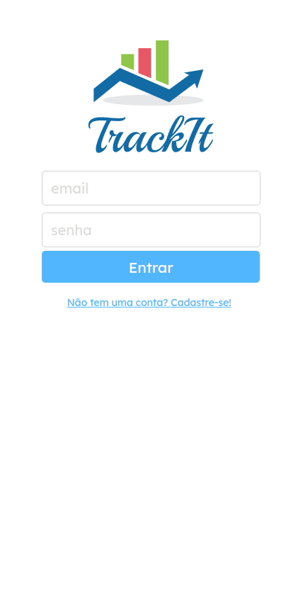

<div align="center">
  <h1>TRACKIT</h1>
  <br>
  - Front-end de um aplicativo web para criação de hábitos e afazeres diários. 
  <br>
  <br>
  <div align="center">
  <a href="http://track-it-sable.vercel.app/"></a>
  <br>
  <br>
  <p>Clique na imagem para acessar a página</p>
</div>
</div>
<br>
  
# Funcionalidades
- Tela com foco principal para mobile
- Login e cadastro de usuário
- Conexão com a API utilizando axios, e acesso através do token de usuário
- Criação e exclusão dos hábitos
- Progresso do usuário a cada hábito concluido
- Escolha de dias específicos para os seus hábitos
- Acesso a tela de histórico para acompanhar a sua evolução com calendário
- Utilização de rotas privadas, acesso restrito para usuários com login
- Persistência dos dados através do local storage

# Tecnologias utilizadas
- HTML5
- CSS3
- JAVASCRIPT
- REACT
- AXIOS
- REACT-ROUTER-DOM
- REACT-LOADER-SPINNER
- REACT-CIRCULAR-PROGRESSBAR
- REACT-CALENDAR
- DAYJS
- GIT
- GITHUB
- VSCODE
- LINUX
- VERCEL

# Como rodar
1. Clone esse repositório
2. Instale as dependências:
```bash
npm i
```
3. Rode o projeto:
```bash
npm start
```
4. Para dar build:
```bash
npm run build
```
<br>